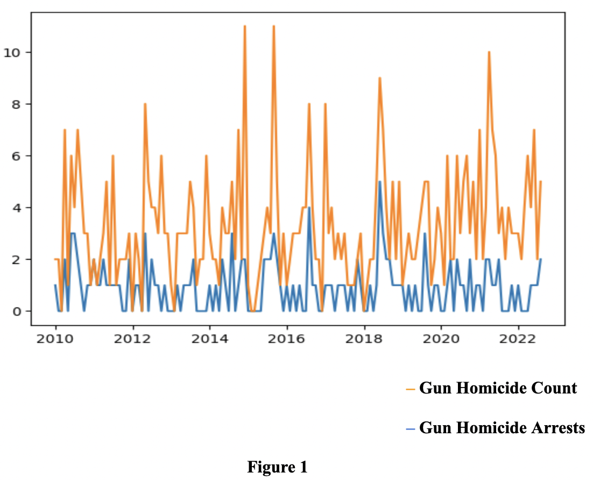
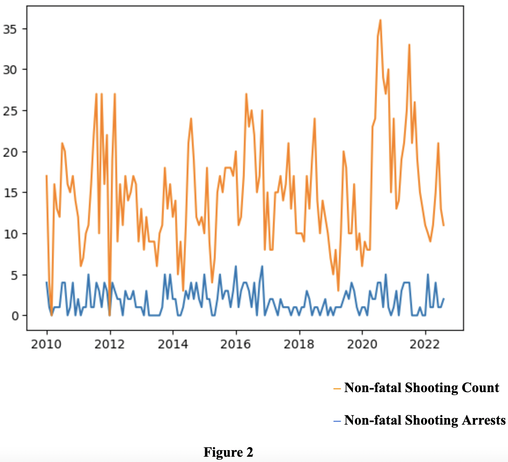
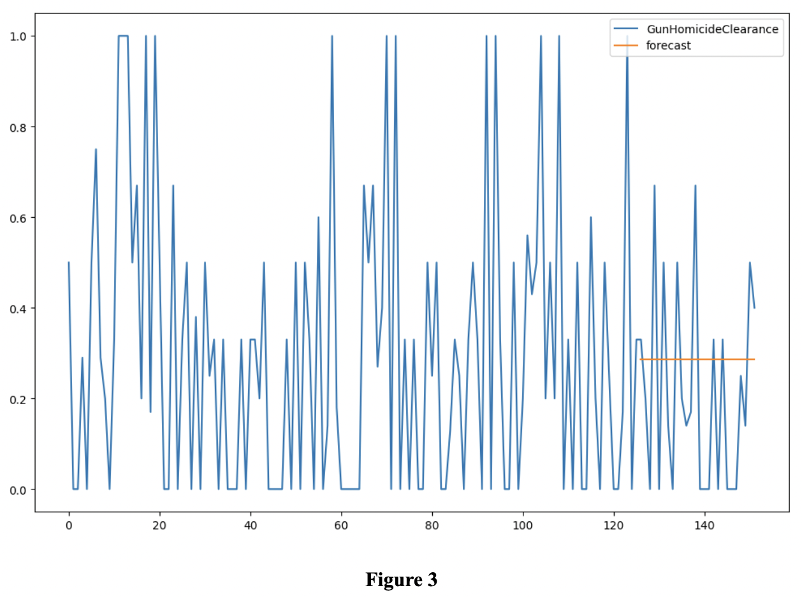
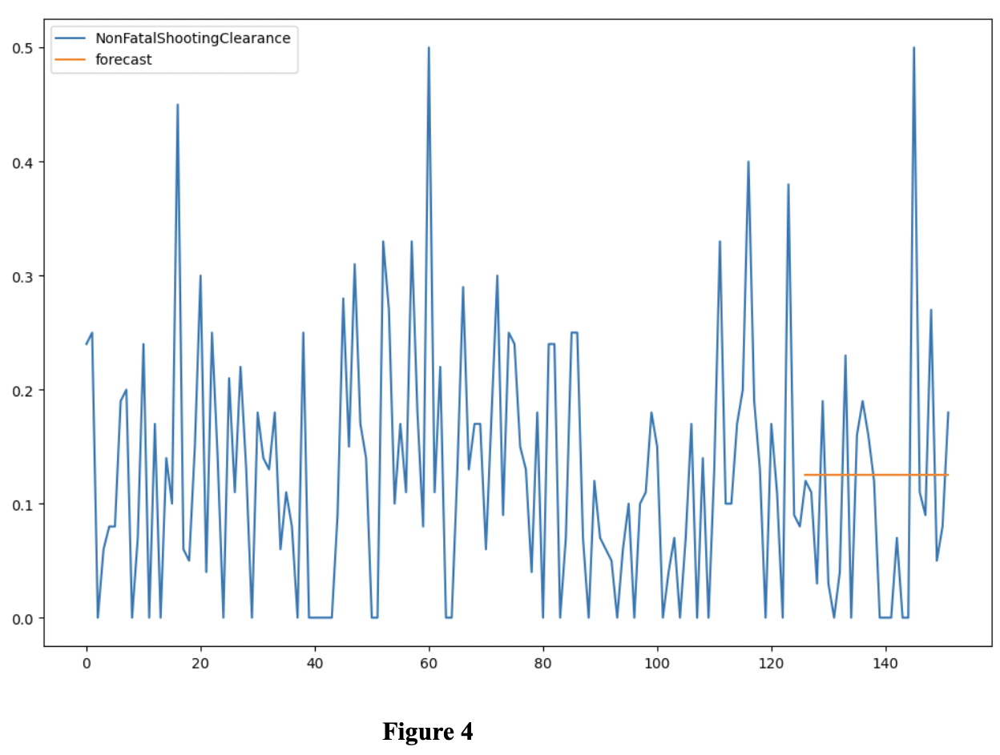

# Project-Safe-Neighborhood
A case review process of gun violence in Buffalo, New York in 2020 using Time Series Analysis

<h2>Problem Statement:</h2>

The goal of this project is to implement a case review process of gun violence in Buffalo NY.  In 2019, Buffalo, NY recorded a homicide rate of 18.8 per 100,000 people and an aggravated assault rate of 611.1, compared to the non-New York City statewide averages of 1.9 and 103.0.  Buffalo, with a population of around 250,000 people, sits towards the top of the state in terms of homicide and gunshot rates.  This crime is concentrated in a few high-crime areas of the city, and gang and drug violence are important contributors.  In response to the problems it faces, the City of Buffalo joined the National Public Safety Partnership in 2017 to combat violent crime and boost public safety.

<h2>Introduction:</h2>

A number of high-risk individuals who reside in neighborhoods in the City of Buffalo are responsible for a large amount of shooting violence.  Analysis identified that a disproportionate amount of violent crime, specifically gun crime, is carried out by individuals that are members of or associated with local street gangs in the City of Buffalo. 
Despite continuous progress, gun violence remains a problem in Buffalo.

Low clearance rates for gun homicides and non-fatal shootings are particularly concerning.  In 2019, Buffalo's nonfatal shooting clearance rate was 15.7%, and its gun homicide rate was 28.2%, both of which were much lower than national forecasts for a city like Buffalo.  Since gun offenders are frequently repeat offenders and frequently participate in retaliation shootings when an arrest is not made, the failure to make arrests for shootings is directly connected to future shooting episodes.

<h2>Data Analysis:</h2>

Python programming was employed to generate autoregressive integrated moving average (ARIMA) models. In this study, ARIMA (0,0,0) models were applied to analyze gun homicide investigations and non-fatal shooting investigations. The model incorporated the introduction of the Shoot Review in June 2020 as the intervention parameter. The visual representations in Figures 1 and 2 provide an overview of the patterns in the distribution of both dependent variables (arrests) and independent variables (incidents) for both of these models.

Figure 3 and Figure 4 illustrate the changes in clearance rates for both gun homicide and non-fatal shooting incidents respectively, comparing the periods before and after the implementation of the intervention.

<h2>Conclusion:</h2>

This study examines how the Buffalo Shoot Review affected the percentage of gun homicides and non-fatal shooting incidents that were cleared by arrests.  Unfortunately, contrary to predictions, the arrest rates for these gun crimes actually increased during the study period, according to our impact analysis.  The process review of this report reveals a number of probable contributing variables to this conclusion, including significant deviations from earlier best practices in the way the Shoot Review was carried out.

The assessment of the impact reveals an unexpected outcome: following the implementation of the Shoot Review in Buffalo, there was a decrease in the proportion of arrests made by the Buffalo Police Department for both gun homicide and non-fatal shooting cases. The influence of the Shoot Review on improving the rate of solving shooting-related crimes through arrests remains indeterminate. Irrespective of the overall impact of the Shoot Review on clearance rates, it is evident that certain aspects of its design may have adversely affected its efficacy. It can be concluded that the intervention did not lead to any noticeable enhancement in the clearance rates for both gun homicide and non-fatal shooting incidents.

